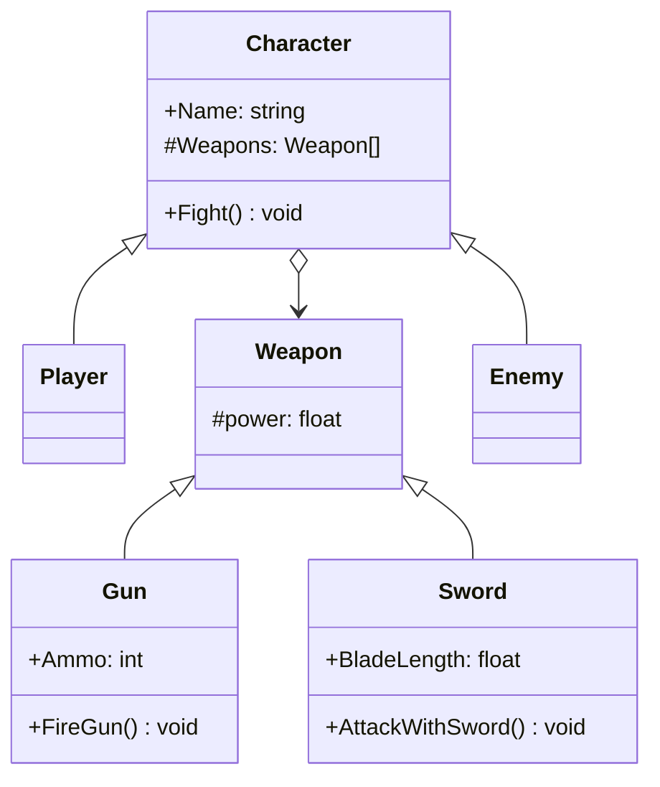

# Mini Game UML Diagram

```mermaid
 classDiagram
    Character <|-- Player
    Character o--> Weapon
    Character <|-- Enemy
    Weapon <|-- Gun
    Weapon <|-- Sword
    
    class Character{
        +Name: string
        #Weapons: Weapon[]
        +Fight() void
    }
    class Weapon{
        #power: float
    }
    class Gun{
        +Ammo: int
        +FireGun() void
    }
    class Sword{
        +BladeLength: float
        +AttackWithSword() void
    }
```
